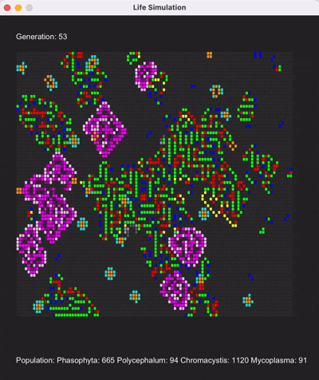

# Multi-Species Life Simulation

## Overview
An advanced cellular automaton simulation implementing a complex ecosystem of multiple species with unique behavioral patterns, symbiotic relationships, and emergent properties. Built with Java and JavaFX, this project demonstrates object-oriented design principles and parallel processing capabilities.

## Technical Highlights

### Sophisticated Cell Behaviors
- **Mycoplasma**: Implements Conway's Game of Life rules with advanced state management
- **Chromacystis**: Features bioluminescent properties with dynamic color transitions based on environmental conditions
- **Phasophyta**: Demonstrates lifecycle-based behavior with aging mechanics and parasitic relationships
- **Polycephalum**: Exhibits non-deterministic decision making with probabilistic state transitions

### Key Features
- Real-time visualization of complex cellular interactions
- Multi-threaded simulation processing
- Dynamic disease propagation system
- Symbiotic relationship modeling between species
- State-based color transformation system

### Architecture
- Robust object-oriented design with abstract base classes
- Event-driven UI architecture using JavaFX
- Efficient grid-based spatial management system
- Thread-safe state management for concurrent operations

### Technical Implementation
- Custom field canvas rendering for optimal performance
- Probabilistic behavior modeling using advanced randomization
- Neighbor detection algorithms for cellular interaction
- State machine implementation for lifecycle management

## Technologies
- Java
- JavaFX
- Object-Oriented Design Patterns
- Multi-threading
- Event-Driven Programming

